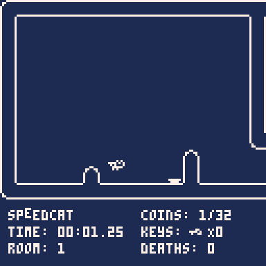

# SPEEDCAT - a game by fletch

## Introduction
SPEEDCAT is a game about a cat that needs to go _fast_. Race against the clock to collect all 32 rainbow coins, while also keeping your death count low! Share your shortest time or least number of deaths with your friends, and try to become the world's best SPEEDCAT!

This is a 2D platformer with a _near_ 1-bit color palette, charming animations, and tight control system. I'm doing my best to refine every rough edge to make this game feel as smooth and complete as possible, while also staying within the limitations imposed by the PICO-8 engine.

This project started as a small effort to grow my own knowledge of [PICO-8](https://www.lexaloffle.com/pico-8.php) and game development in general, but has since become a labor of love. As I continue to develop the game, the game endears itself more and more to me. I hope to finish SPEEDCAT within another year to year and a half, depending on how much time I have to contribute to the project. I intend for it to be released for free on itch.io, with the choice to tip if so desired.
