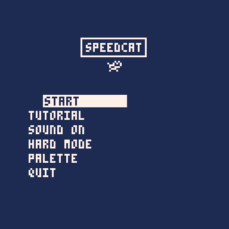
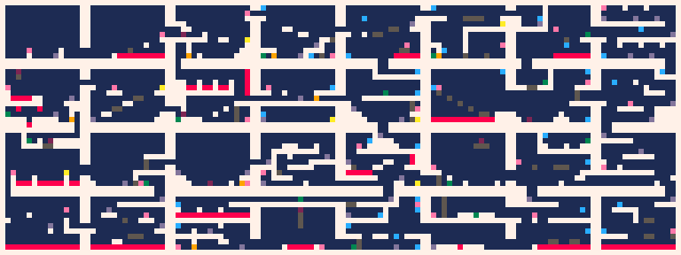

# SPEEDCAT
A game all about collecting coins and being faster than your friends! Play now on itch.io: https://fletchmakesstuff.itch.io/speedcat

## How to Play
Can you be the speediest cat? There are 32 different "rooms" that you can explore. Within each room, there is exactly one (1) SPEEDCOIN that you can collect! Collecting the 32nd coin will immediately end the game and display your completion time and the number of deaths you had!

### Victory screen

Collect all 32 coins and this victory screen could be yours!
The coins can be collected in any order, so use your creativity to think of creative routes to get those coins even faster the next time! Or, you could attempt a no-deaths run! Share your high scores in the comments below to compete with the SPEEDCAT community!

### Modes of Play:
In SPEEDCAT, there are two modes: "Normal Mode" and "Hard Mode". The only difference between the two modes is that some blocks will blink on and off in "Hard Mode", making some jumps more difficult than in "Normal Mode". Other than that, the modes are identical.

## Controls
*In-game:*
* Left & right arrow keys - move SPEEDCAT
* "Z" or up arrow key - jump

*In menus:*
* Arrow keys - navigate menu
* "Z" - select option

*PICO-8 menus:*
* "P" - open menu
* "ENTER" - select option
* Arrow keys - navigate menu

## World Map

*A quick look at the room layout! Rooms are numbered 1-32 from left-to-right, then top-to-bottom (room 1 is top-left and room 32 is bottom-right)*

This is a handy reference in case you want to heavily optimize your route! Each square on this map represents one cel in-game (an 8x8 region). Here's a legend for what each color means:
* White - walls / floors / ceilings
* Pink - SPEEDCOINs
* Bright red - spikes
* Greyish purple - springs
* Maroon - crates / pushable blocks
* Yellow - keys
* Gold - doors
* Blue - teleporters
* Grey - switch blocks
* Dark green - buttons or levers

## About the Game
SPEEDCAT has been my "pet" project for the past 2.5 years. It started as an experiment for myself to learn more about how to detect and resolve 2d collisions. When I started, I didn't realize I'd be finishing the entire game!

I've taken my time on this game. Whenever I felt like my heart was in it, I'd put some work into the game, and whenever I was feeling burnt out, I took a break! So while it's taken longer to develop than the average development time for a game this size, I feel like this game is the culmination of all I've learned thus far in game development!

## Credits
* Developed by: Fletch
* Written in: PICO-8
* Background music composed by: Andrew Carlson
* Playtested by:
  * Clark O Tron
  * Benny
  * Cowboy
  * Salayna (Sachi)
  * SpicyCheeseBite
  * Spak
  * PixelDud
* Thanks to jacobpierce for their [reproduction of the PICO-8 font](https://github.com/jacobpierce/pico-8-font) for use in the trailer and other promotional graphics
* Huge shoutout to my wife for all of her support and encouragement throughout the entire development process. Her words of excitment and encouragement helped me through many speedbumps!
